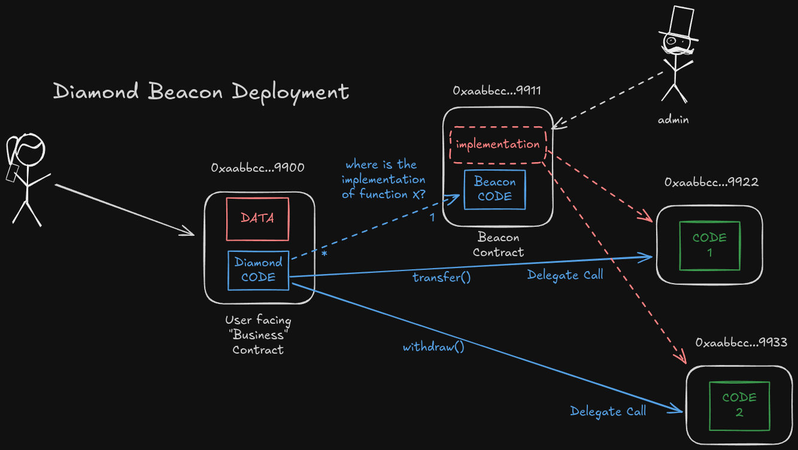

## Beacon Diamond

A Beacon Diamond is a mix of a Diamond and a Beacon Proxy. This allows for the
central implementation management of multiple contract instances.

The implementation is based on `diamond-1-hardhat` and OpenZeppelin's
BeaconProxy contracts. Thank you for that.

See `Example.t.sol` and `ExampleUpgradeable.t.sol` for usage examples.

### Overview



### Development

Build:

```shell
forge build --sizes
```

Test:

```shell
forge test -vvv
```

